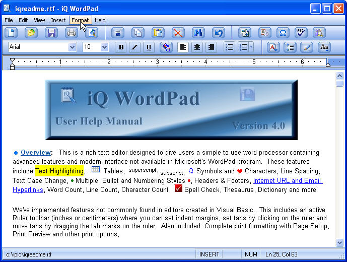

## iQ WordPad \(Update: 25 November, 2007\)

### Description

Update 4.0 - Rich text editor designed to give users a complete but simple to use Word Processor containing advanced features and modern interface not found in MS WordPad. Features include text highlighting, tables, line spacing, Internet and Email hyperlink, superscript, subscript, symbols, headers, footers, word count, spell check, and several more. Includes feature's not commonly found in editors created in Visual Basic. This includes an active Ruler toolbar (inches or centimeters) where you can set indent margins, set tabs by clicking on the ruler and move tabs by dragging tab marks on the ruler bar. Also, print formatting with Page Setup, Print Preview and other options. Be sure to view the iqreadme.rtf document for details of the project and samples of the features. Complete Help Manual available from the Help Menu. (Update: Ver.4.0 - Added Recent Fonts menu, fixed table width bug and more. View IQREADME.RTF for update details and history.)
 
### More Info
 

             |
---                |---
**Submitted On**   |2007-11-25 09:03:26
**By**             |[Tom Moran](https://github.com/Planet-Source-Code/PSCIndex/blob/master/ByAuthor/tom-moran.md)
**Level**          |Intermediate
**User Rating**    |5.0 (160 globes from 32 users)
**Compatibility**  |VB 6\.0
**Category**       |[Complete Applications](https://github.com/Planet-Source-Code/PSCIndex/blob/master/ByCategory/complete-applications__1-27.md)
**World**          |[Visual Basic](https://github.com/Planet-Source-Code/PSCIndex/blob/master/ByWorld/visual-basic.md)
**Archive File**   |[iQ\_WordPad20918411252007\.zip](https://github.com/Planet-Source-Code/tom-moran-iq-wordpad-update-25-november-2007__1-69067/archive/master.zip)

### API Declarations

Several

